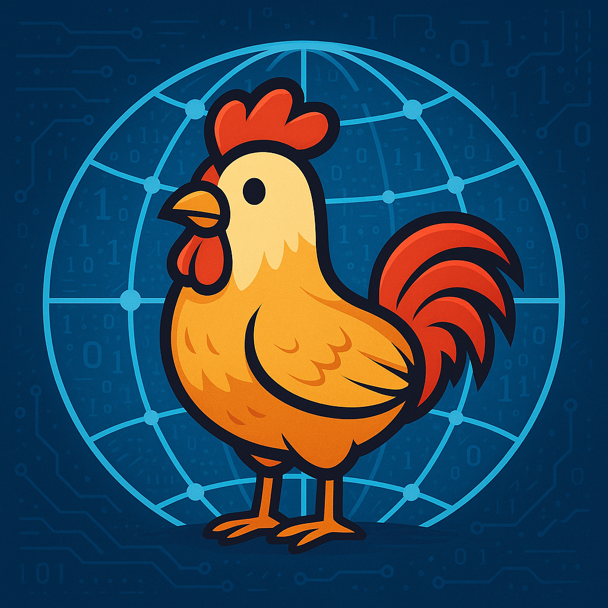

# chicken-api 🐔🌐

[](https://github.com/qWeX23/chicken-api/actions/workflows/ci.yml)
[](https://opensource.org/licenses/MIT)
[](https://github.com/qWeX23/chicken-api/issues)
[](https://github.com/qWeX23/chicken-api/commits/main)
[](https://github.com/qWeX23/chicken-api)
[](https://www.buymeacoffee.com/qwex)



Welcome to the Chicken API! This project is a fun, open-source API for all things chicken. Whether you're a developer looking for a unique API to integrate into your project, or a chicken enthusiast who wants to contribute, you've come to the right place.

## How It Works

The Chicken API is designed to be a community-driven resource. Here's a quick overview of how it works:

- **Get Chicken and Breed Data:** You can easily retrieve information about various chicken breeds and individual chickens through our API endpoints.
- **Suggest a New Breed or Chicken:** Want to add a new breed or your own chicken to the API? You can submit your suggestions through a `POST` request.
- **Review Process:** All submissions are added to a review queue. Our team manually reviews each submission to ensure accuracy and appropriateness.
- **Promotion to Main App:** Once a submission is approved, it's promoted to the main application and becomes available to all users.

## How to Contribute

We welcome contributions of all kinds! Here are a few ways you can help:

- **Submit a Pull Request:** Have a new feature in mind? Want to fix a bug? We'd love to see your pull requests.
- **Create an Issue:** Found a bug or have an idea for a new feature? Open an issue and let's discuss it.
- **Suggest a New Breed or Chicken:** Have a favorite breed that's not in our database? Want to add your own chicken? We'd love to see your suggestions.
- **Improve Documentation:** See a way to make our documentation clearer? We appreciate all documentation improvements.

## Logging

The application uses [kotlin-logging](https://github.com/MicroUtils/kotlin-logging) with Logback. Log messages include a `requestId` for correlation and are written in plain text locally and JSON in production.

Adjust log levels in `application.properties` or via the `logging.level` system property, e.g.:

```properties
logging.level.co.qwex=DEBUG
```

## Using the API

The Chicken API is free and easy to use. Check out our [API Documentation](https://chickenapi.com/swagger-ui/index.html) to get started. We're excited to see what you build!

### Get All Breeds

```bash
curl -X GET "https://chickenapi.com/api/v1/breeds/"
```

### Get a Specific Breed by ID

```bash
curl -X GET "https://chickenapi.com/api/v1/breeds/1"
```

### Submit a New Breed for Review

```bash
curl -X POST "https://chickenapi.com/api/v1/breeds/" \
-H "Content-Type: application/json" \
-d '{
  "name": "Awesome Chicken",
  "origin": "My Backyard",
  "eggColor": "Blue",
  "eggSize": "Large",
  "eggNumber": 200,
  "temperament": "Friendly",
  "description": "A very awesome chicken.",
  "imageUrl": "http://example.com/awesome.jpg"
}'
```

### Get a Specific Chicken by ID

```bash
curl -X GET "https://chickenapi.com/api/v1/chickens/1"
```

### Submit a New Chicken for Review

```bash
curl -X POST "https://chickenapi.com/api/v1/chickens" \
-H "Content-Type: application/json" \
-d '{
  "name": "Cluck Norris",
  "breedId": 1,
  "imageUrl": "http://example.com/cluck.jpg"
}'
```

### Get AI-Generated Chicken Facts

Get interesting, recent chicken facts powered by our cloud AI agent:

```bash
curl -X GET "https://chickenapi.com/api/v1/chicken-facts"
```

The endpoint uses a cloud-based AI agent (Ollama Cloud via Koog) to research and return fascinating chicken facts with source citations. The facts are formatted as markdown bullet points.
